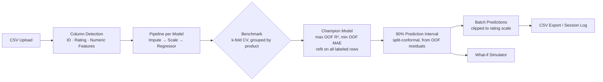

# Scoring Tool

**Predict third-party product ratings before they're published — regression benchmarking with honest validation and calibrated uncertainty.**

A lightweight Flask web application that trains machine-learning regression models on historical product test results and predicts the **overall rating (0–100)** a product would receive from an independent testing organization — before that rating exists. Every prediction ships with a **calibrated 90% prediction interval** (split-conformal), so users see not just a number but how much to trust it.

Built for product teams who want to estimate how a new or hypothetical product will be rated, using nothing more than a CSV of historical test data.

> **About this repository** — this is the public overview of a privately developed tool: it documents the product, architecture, and statistical methodology. The implementation source is not published.

---

## Why this exists

Independent testing organizations publish influential overall ratings for consumer products, but those ratings arrive **after** a product ships — far too late to influence design. Product teams, however, already measure most of the underlying test attributes in their own labs during development.

This tool closes that gap: it learns the relationship between historical test attributes and the published overall rating, then applies it to products that haven't been rated yet — turning the rating from a post-launch verdict into a **design-time target**.

## Feature Highlights

- **One-click CSV ingestion** — upload a dataset and the app automatically detects the product identifier column, the target rating column, and every numeric predictor. No manual column mapping, no configuration files.
- **Multi-model benchmark** — three regressors (Linear Regression, CV-tuned Ridge, Random Forest) are trained side by side inside identical preprocessing pipelines (imputation → standardization) and benchmarked with **k-fold cross-validation grouped by product**, so the same product never appears on both sides of a split.
- **Honest metrics, automatic champion selection** — R² and MAE are computed on pooled **out-of-fold predictions**: every labeled row is scored by a model that never saw it. The champion (highest out-of-fold R², MAE tie-break) is then refit on all labeled data for inference.
- **Calibrated uncertainty** — every prediction carries a **split-conformal 90% prediction interval** derived from out-of-fold residuals. For exchangeable data this guarantees at least 90% marginal coverage — a statistical property, not a vibe.
- **Batch scoring with export** — score an entire product catalog in one upload and download the full prediction table as CSV, including a `prediction_basis` column that records whether each row was scored out-of-fold or by the final model.
- **What-if simulator** — type hypothetical test values and instantly see the predicted rating with its interval. Blank fields fall back to training-set means, and the UI warns when an input lies outside the range seen during training (extrapolation flag).
- **Product segmentation** — K-means clustering over standardized test profiles, with the segment count chosen by silhouette score and visualized on a PCA map. The silhouette value is always displayed, so weak cluster structure is visible instead of dressed up as insight.
- **Zero-install distribution** — the tool packages into a single Windows executable that starts the server silently and opens the browser; the UI is fully self-contained (no CDN, no external assets), so it runs on air-gapped machines.

## How It Works

1. **Upload** a CSV of historical products with known ratings (minimum 10 labeled rows — below that, cross-validated metrics are statistically meaningless and the app says so).
2. Column names are **normalized**, the identifier and rating columns are detected from alias lists, and all remaining numeric columns become predictors. A numeric product ID is treated as an identifier, never a predictor.
3. Three pipelines are **benchmarked with grouped k-fold cross-validation** and ranked by out-of-fold R² and MAE.
4. The **champion is refit** on all labeled rows and scores the full catalog. Rows with a known rating display their *out-of-fold* prediction, so the table reflects real generalization rather than memorized training fit.
5. The **what-if page** exposes the model interactively: change one test value, watch the predicted rating and its interval move.

## Screens

| Page | Purpose |
|---|---|
| **Home** | Overview and quick-start |
| **Upload & Train** | CSV upload, automatic training and model selection |
| **Predictions** | Model leaderboard (R² / MAE), full prediction table, CSV download |
| **What-if Simulator** | Interactive single-product rating simulation |
| **Segments** | K-means product segmentation with silhouette diagnostics and PCA map |
| **Session Log** | Review and export batch predictions and every what-if run |

## Methodology at a Glance

| Model | Role |
|---|---|
| Linear Regression | Interpretable baseline |
| Ridge Regression (CV-tuned α) | L2 regularization; α selected by internal cross-validation |
| Random Forest | Non-linear interactions, robustness to feature scaling and outliers |

- **Validation:** k-fold cross-validation (up to 5 folds), **grouped by product** whenever a product repeats across rows — eliminating the most common source of silently inflated metrics in product datasets.
- **Reported metrics:** computed on pooled out-of-fold predictions, never on training fit.
- **Prediction interval:** split-conformal with finite-sample correction — the interval width is the corrected quantile of the champion's absolute out-of-fold residuals.
- **Guardrails:** predictions and interval bounds are clipped to the valid rating scale; inputs outside the training range are flagged; datasets below the minimum sample size are rejected with an explanation rather than silently mis-scored.

The full statistical design — including its known limitations and the roadmap to address them — is documented in [docs/METHODOLOGY.md](docs/METHODOLOGY.md).

## Architecture

Three strictly separated layers: a Flask web layer that owns HTTP and session state, a framework-agnostic ML engine that can be lifted into a notebook unchanged, and a dependency-free template layer that keeps the packaged executable fully offline. Details, diagrams, and the request lifecycle are in [docs/ARCHITECTURE.md](docs/ARCHITECTURE.md).

## Input Data Contract

The uploaded CSV needs, at minimum:

| Requirement | Notes |
|---|---|
| **Product identifier** | Detected from common column-name aliases (e.g. `SKU`, `Model`, `Product ID`) |
| **Overall rating** (training target) | Detected by alias, matched in priority order; must be numeric on the rating scale |
| **Predictors** | Any additional numeric columns — test scores, measured attributes, survey metrics |

Robustness built into ingestion: encoding-tolerant CSV parsing (UTF-8 with automatic fallback for files edited in Excel or pasted from the web), whitespace and non-breaking-space cleanup, automatic coercion of mostly-numeric text columns, mean imputation for missing predictor values, and explicit rejection — with a specific, human-readable error — of malformed headers, out-of-range ratings, and undersized datasets.

## Honest Limitations

Documented deliberately — knowing where a model is weak is part of the product:

- **Single-analyst session model** — trained models live in process memory; the tool is designed for individual desktop use, not concurrent multi-user deployment.
- **Constant-width interval** — the conformal band is honest *on average* but does not widen for individually hard-to-predict products (a heteroscedastic conformal variant is on the roadmap).
- **Mild selection optimism** — the champion is chosen on the same out-of-fold metrics that are displayed, so headline metrics carry a small upward bias across the three candidates; nested CV would remove it at ~5× the training cost.
- **Extrapolation** — predicting next year's product means extrapolating beyond the training range, where tree models go flat and linear models extend trends without bound. The what-if page flags this rather than hiding it.

---

*© 2026. Documentation published as a project overview; all rights reserved. The tool's implementation and all product test data remain private. No affiliation with, or endorsement by, any product-testing organization is implied.*
