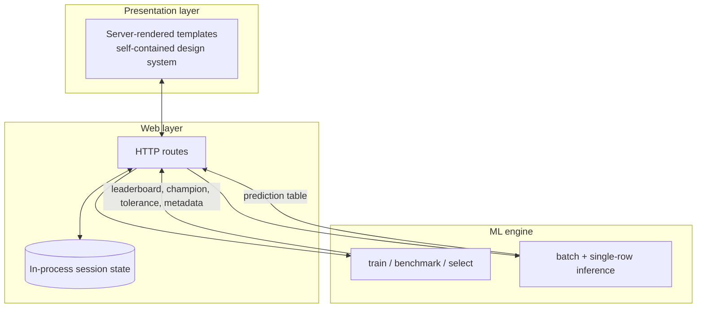

# Architecture

Technical overview of the Scoring Tool's design. For the product-level view, see the [README](../README.md); for the statistical design, see [METHODOLOGY.md](METHODOLOGY.md).

---

## Design Goals

1. **Zero-friction for the analyst** — one CSV in, predictions out. No configuration, no schema files, no notebooks.
2. **Honest by construction** — every displayed metric must be an out-of-sample quantity; the architecture makes it structurally hard to leak training fit into the UI.
3. **Deployable anywhere** — the same codebase runs as a dev server and packages into a single offline Windows executable for non-technical stakeholders. No external assets, no network dependency at runtime.

## Three-Layer Separation

- The **web layer** owns HTTP concerns exclusively: upload handling, column detection and normalization, session state, table rendering, CSV export. It contains no modeling code.
- The **ML engine** owns modeling exclusively: pipeline construction, cross-validated benchmarking, champion selection, conformal calibration, and inference. It imports nothing from the web framework — it can be unit-tested or reused in a notebook as-is.
- The **presentation layer** is pure server-rendered HTML on a self-contained design system: no CDN links, no JavaScript frameworks, no external fonts. This is a deliberate constraint so the packaged executable works fully offline (including on air-gapped machines).

## Runtime Flow

One analysis session, end to end:

1. **Upload** — a single CSV is received (with an upload-size cap; oversized files render a friendly error rather than a bare HTTP 413).
2. **Normalization** — column names are canonicalized (trimmed, lower-cased, spaces to underscores); colliding headers are rejected up front with a specific error, because duplicated labels would break column selection everywhere downstream.
3. **Detection & coercion** — identifier and target columns are matched against alias lists in priority order; the target is coerced to numeric with out-of-range values rejected; mostly-numeric text columns are rescued by coercion; all remaining numeric columns become predictors. Encoding is handled tolerantly (UTF-8 first, with fallbacks for files touched by spreadsheet tools or web copy-paste).
4. **Training** — labeled rows are passed to the ML engine together with product-group labels for leakage-safe cross-validation. The leaderboard, champion model, conformal tolerance, and training metadata come back as plain data.
5. **Prediction** — the champion scores the entire uploaded catalog exactly once, at upload time. Subsequent page views only render cached results — no recomputation per request.
6. **Exploration** — the what-if simulator, segmentation view, session log, and CSV downloads all read from the same cached session state.

## Session Model

State is held in a single in-process store, reset atomically on each new upload — state is only committed after training succeeds, so a failed upload never leaves the app half-updated.

**Deliberate consequence:** state is per-process and single-user. Two browser tabs share one session; a second upload replaces the first; deploying behind a multi-worker WSGI server would break state coherence. This is the right trade-off for the intended use — a single analyst on a desktop — and is documented as an explicit boundary rather than discovered as a bug. A multi-user deployment would move session state into a keyed external store; the layer separation confines that change to the web layer.

## Error-Handling Philosophy

Every anticipated failure mode maps to a **specific, actionable message** rendered in context — never a stack trace, never a generic "something went wrong":

- unreadable or wrongly encoded files → what was wrong and what to do;
- colliding column names → which names collide and how;
- missing identifier/target columns → which aliases are accepted;
- out-of-range ratings → how many rows are invalid and why training was refused;
- undersized datasets → the minimum row count and the statistical reason it exists.

## Packaging

The tool ships two ways from one codebase:

| Channel | Audience | Mechanics |
|---|---|---|
| Python web app | Developers / analysts with Python | Standard Flask dev server |
| Single-file Windows executable | Non-technical stakeholders | PyInstaller one-file build; templates bundled into the binary; a launcher starts the server silently (no console window) and opens the default browser |

The offline-first UI constraint (no external assets) is what makes the executable genuinely portable: double-click, browser opens, everything works — no install, no network, no prerequisites.
